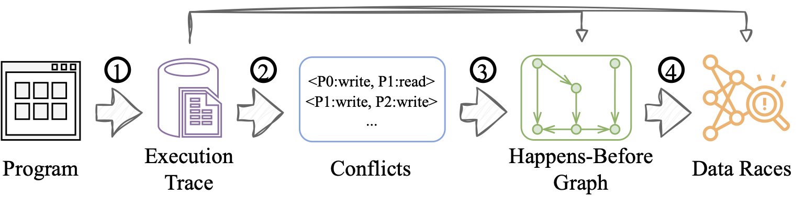
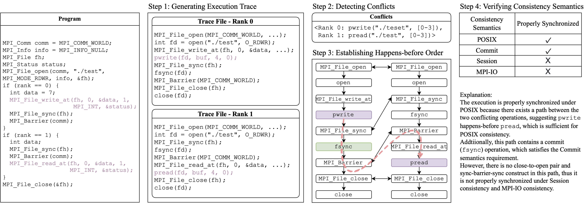

# VerifyIO Workflow

VerifyIO is an open-source tool designed for verifying I/O consistency semantics in High-Performance Computing (HPC) applications. It addresses the challenges of ensuring correctness and portability across different I/O consistency models, such as POSIX, Commit, Session, and MPI-IO. By analyzing execution traces, detecting conflicts, and verifying synchronization adherence, VerifyIO provides actionable insights for both application developers and I/O library designers.

The verification workflow is trace-driven and consists of four steps:

1. Collect the execution trace. The trace file needs to include I/O calls, MPI calls and all of their call arguments for the subsequent verificaiton processes. VerifyIO relies on [Recorder](https://github.com/uiuc-hpc/Recorder) to collect such detailed infomration.
2. Detect data conflicts. Two I/O operations conflict if they access the same location of the same file, and one of them is a write operation.
3. Build the happens-before graph. Recorder traces also include communication (MPI) events, which we use to build a happens-before graph to demtermine later whether two conflicting I/O operations are properly synchornized. Each node in the graph represents either an MPI event or an I/O event. If there's a path from node A to node B, then we say node A happens-before node B.
4. Verify proper synchronization. This step iterates over all conflicting pairs and verify if all all conflicting I/O opertions are properly synchronized according to the specified consistency model.

Here's a workflow example:

